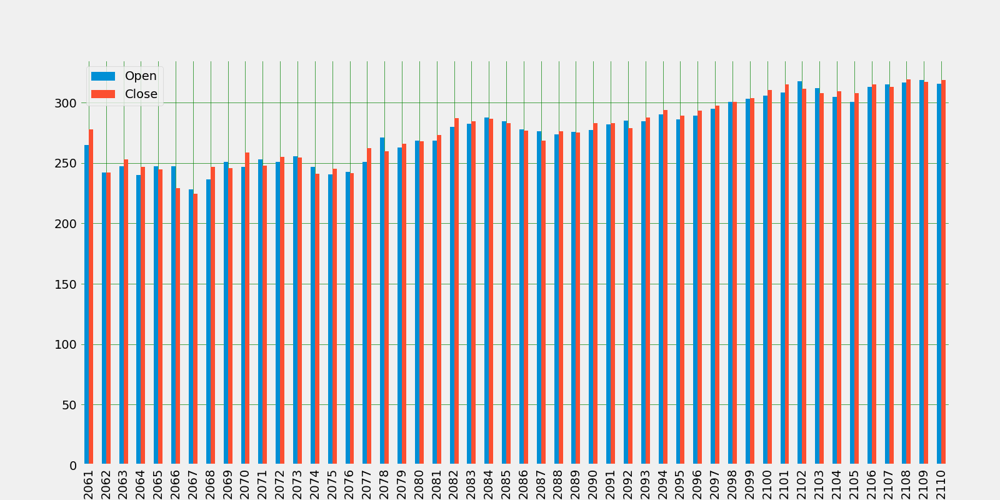
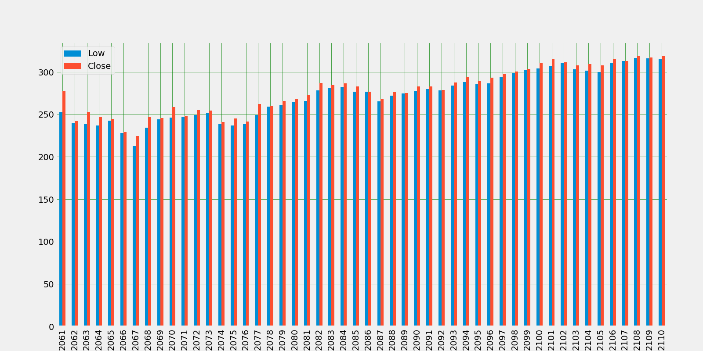
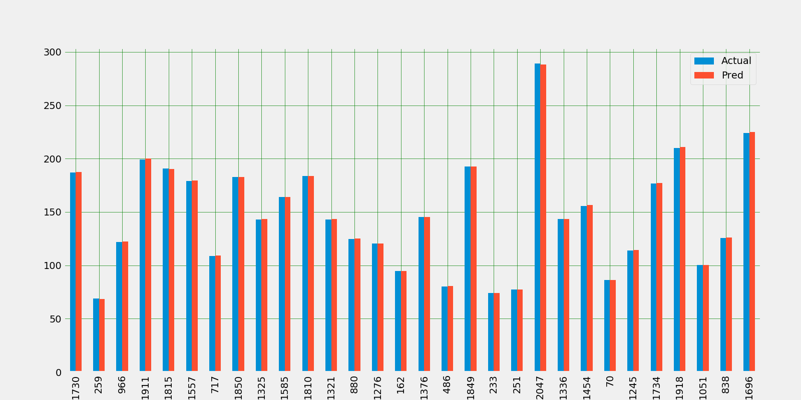

# Stock Price Prediction

### Stock Name: AAPL (Apple)

Stock Market Basic Influencing Factor:

1. Closing Price
2. Opening Price
3. After-Hour Trading

Libraries

- Pandas
- Scikit-learn
- Matplotlib
- Numpy
- Pandas_datareader.data
- Seaborn
- OS

Coding

1. Dataset Import

pandas_datareader library allows us to connect to the website and extract data directly from internet sources, in this case we are extracting data from Yahoo Finance API.
I have kept APPL.csv file too (if anyone wants to play with it.)

Using following code:

df = web.DataReader("AAPL", 'yahoo', start, end)

Where:

start = datetime.datetime(2012, 1, 1)

end = datetime.datetime(2020, 5, 22)

2. Checking Correlation

Correlation is a measure of association or dependency between two features i.e. how much Y will vary with a variation in X. The correlation method that we will use is the Pearson Correlation.

Using Pearson Correlation coefficient:

corr=df.corr(method='pearson')

Pearson Correlation Coefficient is the most popular way to measure correlation, the range of values varies from -1 to 1. In mathematics/physics terms it can be understood as if two features are positively correlated then they are directly proportional and if they share negative correlation then they are inversely proportional.

### EDA (Explanatory Data Analysis)

#### Visualize the Dependent variable with independent variable

#### Bar plot of Open Price VS Close Price (Year 2012)
Let's take a look at the bar plot of top 50 data which is from 2012 year

#### Bar plot of Open Price VS Close Price (Year 2020)
Let's take a look at the bar plot of top 50 data which is from 2020 year

#### Bar plot of High Price of a day VS Close Price (Year 2012)
Let's take a look at the bar plot of top 50 data which is from 2012 year

#### Bar plot of High Price of a day VS Close Price (Year 2020)
Let's take a look at the bar plot of top 50 data which is from 2020 year

#### Bar plot of Low Price of a day VS Close Price (Year 2012)
Let's take a look at the bar plot of top 50 data which is from 2012 year

#### Bar plot of Low Price of a day VS Close Price (Year 2020)
Let's take a look at the bar plot of top 50 data which is from 2020 year

### Linear Regression Model
Linear Model Cross-Validation:

Basically Cross Validation is a technique using which Model is evaluated on the dataset on which it is not trained i.e. it can be a test data or can be another set as per availability or feasibility.

number of splits: 20

Accuracy: 99.99743780203187

#### Plot Actual vs Predicted Value of Linear Regression Model

### KNN: K-nearest neighbor Regression Model

k neighbors = 4

Accuracy: 99.91435220285842

#### Plot Actual vs Predicted Value of kNN Model

### SVM Support Vector Machine Regression Model

Accuracy: 99.99301338392715

#### Plot Actual vs Predicted Value of SVM

### RMSE (Root Mean Square Error)

Root Mean Square Error is the Standard Deviation of residuals, which are a measure of how far data points are from the regression. Or in simple terms how concentrated the data points are around the best fit line.

Linear Model RMSE: 3.0534992716871643e-14

KNN Model RMSE: 1.191675778610913

SVM Model RMSE: 0.5182098703394772

### R-Squared Error
R-Squared score varies between 0 to 100%.

Mathematical Formula for R-squared score:(y_test[i] — y_pred[i]) **2

Linear R-Squared: 1.0

KNN R-Squared: 0.999629726665711

SVM R-Squared: 0.9999299807307482